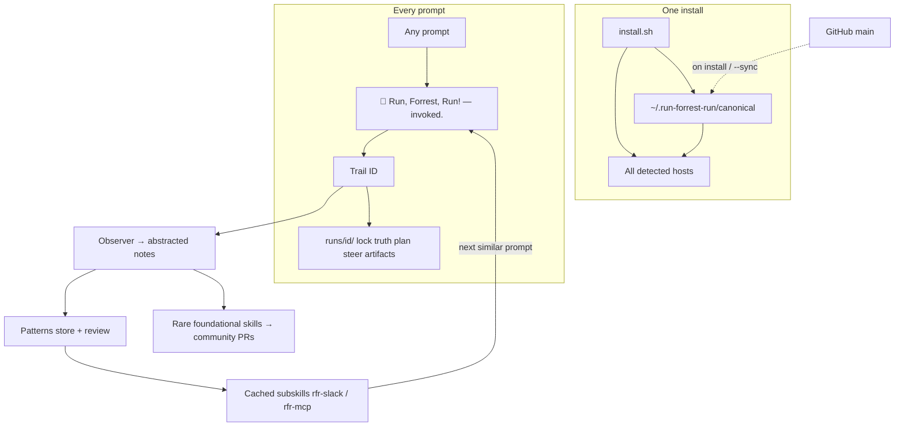

# Run, Forrest, Run!


**One install. Every IDE and CLI on your machine. One trail per prompt.**

Run, Forrest, Run! is the default **objective runner** for AI coding agents — not a chatbot skin, not a frozen prompt pack. Every prompt becomes a job with evidence on disk, two-line updates, full autonomy, and one-line course correction whenever you want to steer.

Movie spelling. Famous line. **Run, Forrest, Run!** (two r’s in Forrest.)

---

## Table of contents

1. [Install in 30 seconds](#install-in-30-seconds)
2. [What you get](#what-you-get)
3. [Why you always get the latest — not a baseline from install day](#why-you-always-get-the-latest--not-a-baseline-from-install-day)
4. [The two-line voice](#the-two-line-voice)
5. [How a prompt becomes a trail](#how-a-prompt-becomes-a-trail)
6. [Where everything lives on disk](#where-everything-lives-on-disk)
7. [Supported hosts](#supported-hosts)
8. [Commands](#commands)
9. [Tenets and constitution](#tenets-and-constitution)
10. [How the platform evolves](#how-the-platform-evolves)
11. [For contributors and reviewers](#for-contributors-and-reviewers)
12. [License](#license)

---

## Install in 30 seconds

**Vibe coders:** clone, run one script, reload your IDE. Done.

```bash
git clone https://github.com/youtextme/run-forrest-run.git
cd run-forrest-run
chmod +x install.sh && ./install.sh
```

**Standalone repo not live yet?** Use the mirror branch (same tree, ready to publish):

```bash
git clone -b run-forrest-run-standalone https://github.com/youtextme/figureitout.git run-forrest-run
cd run-forrest-run
chmod +x install.sh && ./install.sh
```

Then publish your own copy: `./publish.sh` (needs `gh auth login` with repo-create access).

**No clone?** Paste [`PROMPT.md`](PROMPT.md) into any AI chat to bootstrap the skill by hand.

**Python only:**

```bash
pip install -e .
python3 -m runforrestrun --install
python3 -m runforrestrun --watch   # pick up IDEs you install later
```

Reload Cursor, VS Code, Claude Code, Devin, OpenClaw, or whatever you use. After that, **any prompt is a trail.**

Kill switch (sandbox only): `RUN_FORREST_LOCKDOWN=1`

---

## What you get

This is the full inventory — not marketing fluff. After `./install.sh`, you have all of this:

| You get | What it does | Where it lives |
|--------|----------------|----------------|
| **Default skill** | Every prompt starts as an objective. `alwaysApply: true` on supported hosts. | Copied into Cursor, Claude, Devin, VS Code, Agent Skills, etc. |
| **Two-line voice** | Exactly two 🌲 lines per update. Funny and boardroom-safe. Steer anytime. | [`runforrestrun/voice.py`](runforrestrun/voice.py) + canonical `SKILL.md` |
| **One trail per prompt** | Lock, truth atoms, plan, events, steer log, artifacts, checkpoint — one run ID. | `~/.run-forrest-run/runs/<id>/` |
| **Canonical brain** | One source of truth; every host copies from here. Update once, all IDEs sync. | `~/.run-forrest-run/canonical/` |
| **Host auto-detect** | Finds Cursor, VS Code, Windsurf, Zed, Claude, Devin, OpenClaw, Codex, Aider, Goose, Gemini CLI, Amp, Continue, Agent Skills, and the CLI. | [`runforrestrun/hosts.py`](runforrestrun/hosts.py) |
| **New-host watcher** | Install a new IDE tomorrow → `--watch` defaults it automatically. No second install ritual. | `python3 -m runforrestrun --watch` |
| **Upstream sync** | Pull latest skill, constitution, and community catalog from GitHub `main` on every install/sync. | [`runforrestrun/upstream.py`](runforrestrun/upstream.py) |
| **Frontier catalog** | LangGraph, CrewAI, AutoGen, and other loops as **methods** — compose them, don’t freeze them as law. | [`runforrestrun/frontier.json`](runforrestrun/frontier.json) |
| **Observer** | Learns *how* you work. Strips names, emails, paths. Never ships who you are. | `~/.run-forrest-run/observations/` |
| **Model-aware cached skills** | Stores patterns, reviews them, mints subskills from proven access (Slack, MCP, …). Next similar prompt cheap-pings the cache. | `~/.run-forrest-run/skills/` + `patterns/` |
| **Platform proposals** | Rare foundational capabilities only — opt-in PRs with **full credit** to you. Not a PR per prompt. | `~/.run-forrest-run/platform/proposals/` |
| **CLI shim** | `run-forrest-run "fix the failing test"` from any shell. | `~/.local/bin/run-forrest-run` |
| **Zero runtime deps** | Pure Python 3.10+. No pip packages required to run. | [`pyproject.toml`](pyproject.toml) |



---

## Why you always get the latest — not a baseline from install day

Most agent skills are **frozen at copy time**. You install once in March; your IDE still runs March’s wording in August.

Run, Forrest, Run! is built the other way:

| Mechanism | What refreshes | When |
|-----------|----------------|------|
| **`--install` / `./install.sh`** | Pulls `SKILL.md`, `AGENTS.md`, constitution, build guide, and `frontier.json` from **`main`** on GitHub | Every install |
| **`--sync`** | Re-pulls canonical from `main` and re-copies into every host | On demand |
| **`--watch`** | Re-scans for new IDEs/CLIs and defaults them with the **current** canonical | After you install a new tool |
| **Packaged fallback** | If you’re offline, uses the copy inside this repo — still works | Automatic |
| **Skip sync** | `RUN_FORREST_SKIP_SYNC=1` — air-gapped or pinned installs only | Your choice |

Upstream source: [`https://github.com/youtextme/run-forrest-run`](https://github.com/youtextme/run-forrest-run) (`main` branch).

After sync, check what landed:

```bash
python3 -m runforrestrun --status
cat ~/.run-forrest-run/canonical/SYNC.json
```

**Serious devs:** the behavior contract lives in root [`SKILL.md`](SKILL.md) and [`RUN_FOREST_RUN.md`](RUN_FOREST_RUN.md). Those files are in `SYNC_FILES` — they update on every sync, not just the Python package version.

---

## The two-line voice

Every agent update is **exactly two lines**. Each line starts with 🌲. No paragraphs.

**Normal run:**

```
🌲 Run, Forrest, Run! — invoked. No warrant on 'the login bug' yet.
🌲 I'll probe it. Type anything to course-correct. Trail `a1b2c3d4e5f6` keeps the findings. I'm autonomous — step away if you want.
```

**Blocked (missing env, lockdown, etc.):**

```
🌲 Run, Forrest, Run! — invoked. No warrant on 'ship to prod' yet.
🌲 I cannot run this autonomously. I need: ANTHROPIC_API_KEY in the environment. Trail `a1b2c3d4e5f6` is waiting — nothing already found is wasted.
```

Type anything anytime. Steer is full freedom. Nothing already on the trail is thrown away.

---

## How a prompt becomes a trail

1. **Lock** — one sentence goal + checks that prove done.
2. **Split atoms** — separate facts, preferences, and unknowns.
3. **Probe** — cheap-ping known warrants; experiment on unknowns.
4. **Do** — implement; never stop at a plan.
5. **Check** — run real commands/tests against the world.
6. **Checkpoint** — write evidence under one run ID.
7. **Report** — two 🌲 lines; invite steer.

Chat is not memory. The trail is.

Full loop spec: [`RUN_FOREST_RUN.md`](RUN_FOREST_RUN.md) · Build guide: [`HOW_TO_BUILD.md`](HOW_TO_BUILD.md)

---

## Where everything lives on disk

```
~/.run-forrest-run/
├── canonical/              ← one brain (skill, version, SYNC.json, docs)
│   ├── SKILL.md
│   ├── AGENTS.md
│   ├── RUN_FOREST_RUN.md
│   ├── SYNC.json           ← last upstream pull (timestamp, ref, files)
│   └── runforrestrun/
│       └── frontier.json   ← community loop catalog (refreshed on sync)
├── runs/<id>/              ← one prompt
│   ├── lock.md
│   ├── truth.md
│   ├── plan.md
│   ├── trail.md
│   ├── checkpoint.json
│   ├── steer.jsonl
│   ├── events.jsonl
│   └── artifacts/
├── observations/           ← how you work (identity stripped)
├── patterns/               ← stored + reviewed work patterns (every prompt)
├── skills/                 ← cached subskills (rfr-slack, …) + catalog.json
├── model-aware/            ← MCP inventory + plugged model gaps
├── platform/proposals/   ← rare foundational skills, opt-in
└── hosts.json              ← IDEs/CLIs already defaulted
```

Human-readable on purpose. Open it in any editor.

Public shape of observations: [`user_observations/`](user_observations/)

---

## Supported hosts

If the tool is on your machine, install defaults it from the same canonical skill:

| Host | What gets written |
|------|-------------------|
| **Cursor** | `.cursor/skills/run-forrest-run/SKILL.md`, `.cursor/rules/run-forrest-run.mdc` |
| **VS Code / Copilot** | `.github/copilot-instructions.md` or workspace instructions |
| **Windsurf, Zed, Continue** | Agent skill paths per host detection |
| **Claude Code** | `.claude/skills/run-forrest-run/SKILL.md` |
| **Devin** | `.devin/skills/run-forrest-run/SKILL.md` |
| **OpenClaw** | `AGENTS.md` block in workspace |
| **Codex, Aider, Goose, Gemini CLI, Amp** | Host-specific instruction files |
| **Agent Skills spec** | `~/.agents/skills/run-forrest-run/SKILL.md` |
| **CLI** | `run-forrest-run` shim in `~/.local/bin` |

New IDE tomorrow?

```bash
python3 -m runforrestrun --watch
```

---

## Commands

```bash
./install.sh                                    # detect hosts + install + watch
python3 -m runforrestrun --install              # install only
python3 -m runforrestrun --sync                 # pull latest from GitHub main + re-default all hosts
python3 -m runforrestrun --watch                # pick up newly installed IDEs/CLIs
python3 -m runforrestrun --status               # canonical home, hosts, last sync
python3 -m runforrestrun "fix the failing test" # start a trail from the shell
python3 -m runforrestrun --steer RUN_ID --message "use purple, not pink"
python3 -m runforrestrun --consent cheap-ping-not-literature --yes --credit "Your Name"
python3 -m runforrestrun --skills                 # cached subskills this machine can cheap-ping
python3 -m runforrestrun --patterns               # stored work patterns
python3 -m runforrestrun --learn                  # review patterns; mint missing skills from proven access
python3 -m runforrestrun --learned-access slack --method mcp --run-id RUN_ID
python3 -m runforrestrun --register-mcp slack --mcp-tool list_channels
python3 -m runforrestrun --plug-gap "didn't know slack MCP" --plug "use rfr-slack" --as-skill slack
python3 -m runforrestrun --json                 # machine-readable output (with other flags)
```

Environment:

| Variable | Effect |
|----------|--------|
| `RUN_FORREST_LOCKDOWN=1` | Sandbox only — autonomy blocked |
| `RUN_FORREST_SKIP_SYNC=1` | Do not pull from GitHub; use packaged copy |
| `RUN_FORREST_UPSTREAM` | Override upstream repo URL |
| `RUN_FORREST_HOME` | Override `~/.run-forrest-run` (tests, custom layout) |

---

## Tenets and constitution

**Closed tenets** (they do not change with the hype cycle):

- **Atoms** — split claims before you act.
- **Probe** — truth is what survived failed disconfirmation against the world.
- **Conservation** — nothing on the trail is wasted; steer adds, it doesn’t erase.

**Methods** (LangGraph, CrewAI, AutoGen, the next loop someone ships) are **gears** in [`frontier.json`](runforrestrun/frontier.json). Compose them. Don’t enshrine them as law.

Full constitution: [`RUN_FOREST_RUN.md`](RUN_FOREST_RUN.md)

Aliases: `run forrest run`, `run forest run`, `true that`

---

## How the platform evolves

We do **not** open a PR for every prompt. That would drown real signal.

1. The **observer** writes abstracted notes — patterns of *how* people work, not *who* they are.
2. **Model-aware** stores those patterns, reviews which method was cheapest, and mints a **cached subskill** when access is proven (Slack, GitHub, an MCP server). The next similar prompt cheap-pings `~/.run-forrest-run/skills/catalog.json` instead of rediscovering the path.
3. When a **foundational** capability appears (reusable across operators), Run, Forrest, Run asks once in two lines.
4. **You choose.** Yes → community skill PR with **full credit** to you. No → stays on your machine.
5. Nothing personal ships. Ever.

That is the movement: millions of operators, a small shared capability set, honest credits.

---

## For contributors and reviewers

**Run tests:**

```bash
pip install -e ".[dev]"
pytest
```

**Project layout:**

```
run-forrest-run/
├── SKILL.md                 ← agent skill (synced to canonical + all hosts)
├── AGENTS.md                ← host instruction block
├── RUN_FOREST_RUN.md        ← constitution (tenets, loop, memory model)
├── HOW_TO_BUILD.md          ← implementers: modules, wiring, extension points
├── PROMPT.md                ← paste bootstrap for any chat
├── runforrestrun/           ← Python package (zero runtime deps)
│   ├── install.py           ← canonical write + host copy
│   ├── upstream.py          ← always-latest sync from main
│   ├── hosts.py             ← IDE/CLI detection
│   ├── trail.py             ← run ID + artifacts
│   ├── voice.py             ← two-line 🌲 formatter
│   ├── observer.py          ← depersonalized observations
│   ├── patterns.py          ← store / review / match work patterns
│   ├── cached_skills.py     ← mint rfr-<surface> subskills from proven access
│   ├── model_aware.py       ← consult catalog, plug model gaps, MCP inventory
│   └── platform.py          ← rare capability proposals + consent
└── tests/test_platform.py
```

**Contribution norms:** see [`CONTRIBUTING.md`](CONTRIBUTING.md).

**Design constraints we keep:**

- Movie spelling: **Forrest** (two r’s).
- Voice: exactly two 🌲 lines per update.
- Tenets: Atoms, Probe, Conservation — closed set.
- Sync: behavior files update from `main`; package version is not the skill version.

---

## License

MIT — fork it, improve the platform, keep credits honest.
